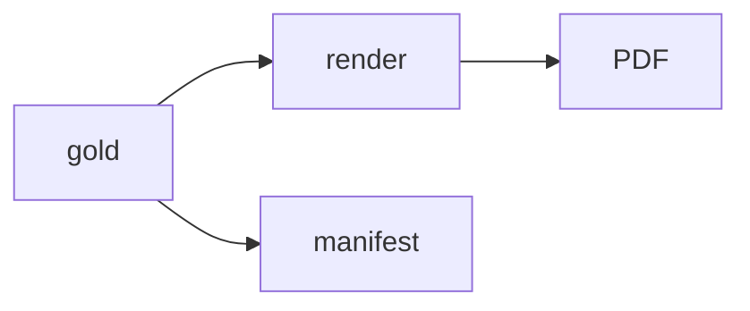

Changed: `src/fixtures/make_inputs.py`, `tests/test_fixtures.py`, `evals/inputs/`, `evals/gold/`, `specs/t2-rescue/tasks.md`, `.ai/HANDOFF.md`, `.ai/STATUS.md`, `.ai/REVIEW.md`.
Did: T4 generated 50 PDF and gold pairs and a 50-row manifest.
Did-not: T5, `docs/DECISIONS.md`, and the existing `.ai/QUESTIONS.md` change.
Check: Unit tests passed (13); compileall passed; secret grep matched only test literals; strict check awaits the T9 workflow.
Risk: n8n PDF extraction awaits the T6 smoke test.
Next: T5.

