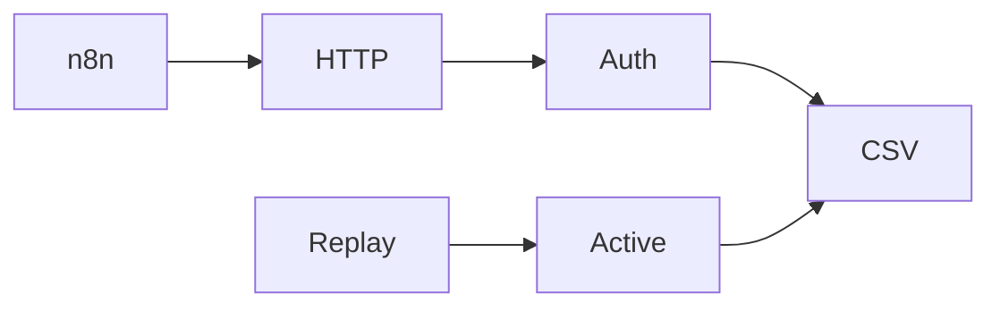

Changed: `src/sink/`, `tests/test_sink.py`, `.env.example`, `specs/t2-rescue/tasks.md`, `.ai/HANDOFF.md`, `.ai/STATUS.md`, `.ai/REVIEW.md`.
Did: T5 added the append-only local HTTP sink and ticked T5.
Did-not: T6, `docs/DECISIONS.md`, and the existing `.ai/QUESTIONS.md` change.
Check: 17 unit tests passed; compileall passed; secret grep found only test literals.
Risk: Automatic approval review blocked the push to `origin` pending approval of its destination and payload.
Next: T6.

