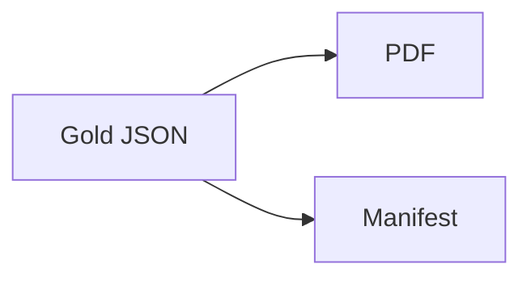

Changed: `src/fixtures/pdfwriter.py`, `src/fixtures/make_inputs.py`, `tests/test_fixtures.py`, `specs/t2-rescue/tasks.md`, `.ai/HANDOFF.md`, `.ai/STATUS.md`, `.ai/REVIEW.md`.
Did: T3 adds a seeded generator for 14 clean and 12 messy synthetic invoices.
Did-not: T4 inputs and the n8n extraction smoke test remain for later tasks.
Check: 13 tests passed. Compileall passed. Secret grep clean. Pdfinfo read one generated PDF.
Risk: n8n Extract From File smoke test waits until T6.
Next: T4.

