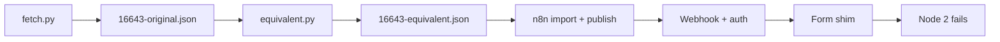

Changed: `src/baseline/`, `tests/test_baseline.py`, `workflows/baseline/DIFF.md`, `README.md`, `.gitignore`, `.ai/QUESTIONS.md` (Q-7), `specs/t2-rescue/tasks.md`, `.ai/HANDOFF.md`, `.ai/STATUS.md`, `.ai/REVIEW.md`.
Did: T6 fetches template 16643, builds the equivalent with swaps S-1..S-8 only, and ticks T6. Upstream JSON is not committed (Q-3).
Did-not: T7, `docs/DECISIONS.md`, `docs/ARCHITECTURE.md`, failure codes, scorecard columns.
Check: 23 unit tests passed; compileall passed; secret grep found only the known pattern literals; smoke on local n8n 2.22.5 ran.
Check: smoke result — the equivalent fails at node 2 (`no binary field 'data'`). With node 2 fixed, node 3 fails (`JSON Body ... not valid JSON`). OpenAI is not called.
Risk: the published template cannot reach its LLM, so the baseline scoring method is open (Q-7). T8 is blocked until the owner answers.
Next: T7.

