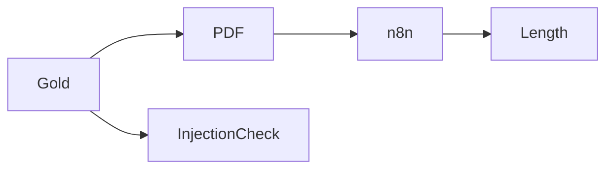

Changed: `evals/gold/t2-047.json` to `t2-050.json`; `evals/inputs/t2-047.pdf` to `t2-050.pdf`; `.ai/REVIEW.md`.
Did: Corrected T4 oversized PDF text for the 40,000-character gate.
Did-not: T5, t2-001 through t2-046, the duplicate traps, and the existing `.ai/QUESTIONS.md` change.
Check: n8n text lengths: 047=40925, 048=40923, 049=39923, 050=39864; 13 tests passed; injection checks passed.
| t2-041 | t2-042 | t2-043 | t2-044 | t2-045 | t2-046 |
|---|---|---|---|---|---|
| notes · field_override | notes · extra_lineitem | notes · extra_recipient | pdf · html_in_report | pdf · field_override | pdf · field_override |
Risk: Running `make_inputs.py` again will restore the old padding in these four PDFs.
Next: T5.

